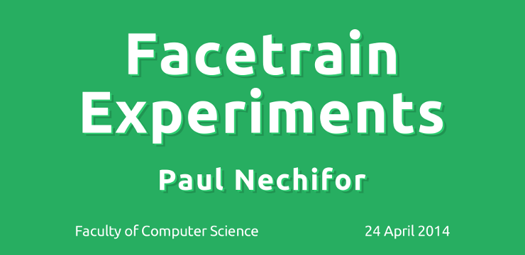

# Facetrain Experiments

My neural networks face training experiments homework for my [Machine Learning
course][course]. This also includes the presentation.

## Navigation

* **bin/** — where the C binaries are built
* **code/** — the C sources (from the [CMU homework][cmu-face])
* **examples/** — examples for the project which are also used in the
presentation
* **faces/** — the provided image faces (from the [CMU homework][cmu-face])
* **lib/** — where the CoffeeScript files are built
* **presentation/** — the source of the presentation for the project
* **src/** — the CoffeeScript sources
* **tasks/** — the project requirements

## Installation

Clone this repo:

    git clone git@github.com:paul-nechifor/facetrain.git
    cd facetrain

Install global dependencies:

    npm install -g coffee-script

You also have to have gcc and python2.

Install the project requirements and compile the C and CoffeeScript files:

    yarn

## Development

If you modify the CoffeeScript or C files rebuild them using:

    yarn make

To run one of the examples:

    coffee examples/scripts/glickman-straight.coffee

## Presentation

The presentation requires running all the provided examples:

    yarn examples

This will take a lot of time.

Build the presentation:

    yarn presentation

## License (for my files)

MIT

[course]: http://thor.info.uaic.ro/~ciortuz/teaching.html
[cmu-face]: http://www.cs.cmu.edu/~awm/15781/2003/hw3/face/
